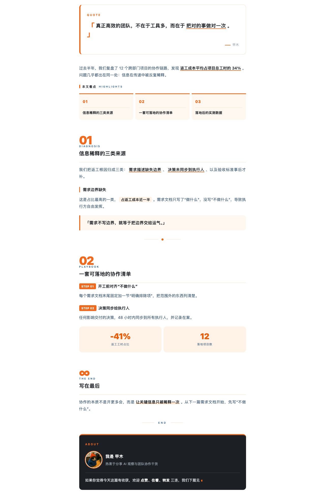

# gzh-catdesign-skill · 公众号排版「深海橙光」

个人专属的微信公众号排版 skill。把一篇 Markdown 文章转换为**可直接复制粘贴进公众号编辑器、且粘贴后样式不丢失**的 HTML。

风格：**亮橙为主色 + 深蓝/深黑文字**的编辑风——橙色负责编号/下划线/竖条/标签，深黑负责标题与金句，首尾「白卡引言 + 深黑签名卡」形成视觉闭环，内置个人猫 IP 头像位。



## 特性

- **一套专属主题「深海橙光」**：亮橙 `#F0691C` 为主色，深黑 `#1C1F24` 文字，提亮蓝 `#245688` 做标签/英文小字点缀。
- **完整发布流程**：Markdown → 合规 HTML → 平台红线校验 → 带「复制到公众号」按钮的预览页 → 粘贴。
- **智能排版**：章节自动编号（01/02…∞）、英文标签、正文关键词下划线、引言卡、精选 3 看点目录、代码块、图片/GIF、作者签名区。
- **多格式输入**：Markdown / Word(.docx) / PDF / 纯文本（非 Markdown 自动归一化），支持「一键自动排版」。
- **个人专属**：`references/persona.md` 集中管理署名/简介/猫 IP，改一处全局生效；猫头像只出现在尾部签名区（作者卡布局）。
- **封面生图**：需要头图时调用 `qiyuan-image` skill 按本主题气质生成。

## 目录

```
gzh-deepsea-design/
├── SKILL.md                     # 流程与决策
├── agents/openai.yaml           # UI 元数据
├── references/
│   ├── theme-deepsea-orange.md  # 「深海橙光」组件库
│   ├── common-components.md     # 通用增量库（代码块/图片/GIF/小标签）
│   ├── format-normalize.md      # docx/pdf/纯文本归一化
│   └── persona.md               # 个人化配置（署名/猫 IP）
├── scripts/
│   ├── validate_gzh_html.py     # 平台合规校验
│   ├── wrap_preview.py          # 生成带复制按钮的预览页
│   ├── extract_docx.py          # docx → markdown
│   └── component_lint.py        # 组件库反模式检查
└── assets/
    ├── preview-template.html    # 预览页外壳
    └── cat-ip.png               # 个人猫 IP 源图
```

## 使用

安装到 `~/.codex/skills/` 后，直接说「把这篇文章排版成公众号 HTML」或「一键自动排版」即可。

产物：
- `{原文件名}_排版_深海橙光(deepsea-orange).html` —— 干净正文，用于校验和手动粘贴兜底。
- `{...}_预览.html` —— 浏览器打开点右上角「复制到公众号」，再到公众号编辑器 ⌘/Ctrl+V 粘贴。

## 平台红线

禁止 `<style>`/`<script>`/`<div>`、`class`/`id`、`position:fixed/absolute/sticky`、`float`、`@media`、`display:grid`、CSS 变量；样式全部内联 `style`，所有文字节点用 `<span leaf="">` 包裹。由 `scripts/validate_gzh_html.py` 强制校验。

## 致谢

排版引擎与组件结构参考 [isjiamu/gzh-design-skill](https://github.com/isjiamu/gzh-design-skill)，配色与组件按个人喜好重新设计。
